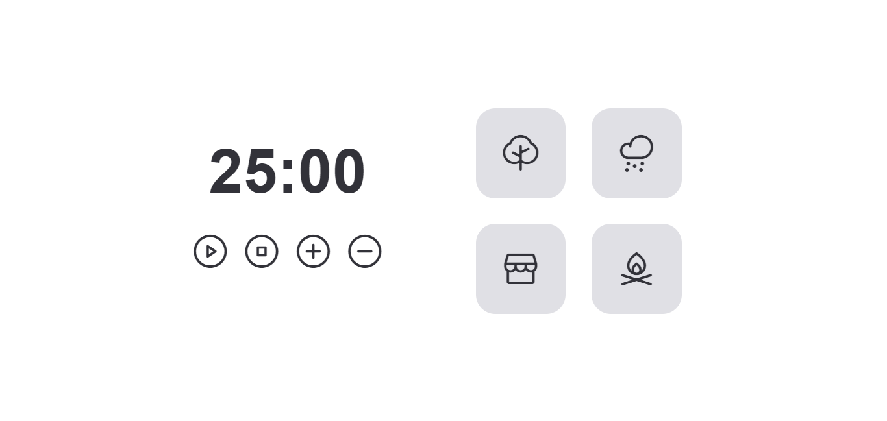

<h1 align="center"> Focus Timer 2 </h1>

Projeto do treinamento da Rocketseat para ensino de tecnologias WEB.

  <a href="#-tecnologias">Tecnologias</a>&nbsp;&nbsp;&nbsp;|&nbsp;&nbsp;&nbsp;
  <a href="#-projeto">Projeto</a>&nbsp;&nbsp;&nbsp;|&nbsp;&nbsp;&nbsp;
  <a href="#-layout">Layout</a>&nbsp;&nbsp;&nbsp;|&nbsp;&nbsp;&nbsp;
  <a href="#memo-licença">Licença</a>

  

 

  

## 🚀 Tecnologias

Esse projeto foi desenvolvido com as seguintes tecnologias:

- HTML, CSS e JavaScript
- Git e Github
- Figma

## 💻 Projeto

O projeto é um temporizador estilo Pomodoro, com 4 opções de som ambiente. As funcionalidades esperadas dos botões são:
- Play   : aciona o timer;
- Stop   : para o timer;
- +: aumenta em mais 5 minutos o tempo do timer;
- -: diminui em 5 minutos o tempo do timer.

Esse projeto é um estudo dos conceitos de JavaScript:
- Modularização de código;
- Factory function;
- Injeção de dependência;
- Prática de manipulação de DOM.

## 🔖 Layout

Você pode visualizar o layout do projeto através [DESSE LINK](https://www.figma.com/file/Pw8yMsK7HFkD6aISZt6gPA/Stage-05---Focus-Timer-2.0/duplicate). É necessário ter conta no [Figma](https://figma.com) para acessá-lo.

## :memo: Licença